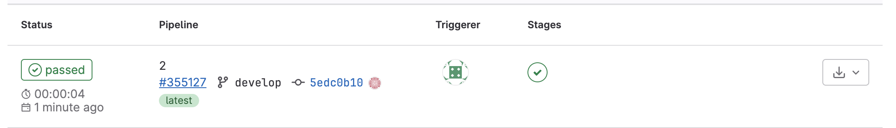
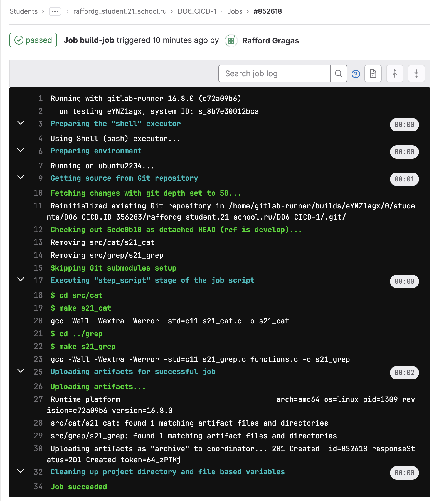

# Report by ananar27

## Part 1 Установка Girlab-Runner
- Целью задания было установить утилиту gitlab-runner на виртуальную машину ubuntu server 22.04 LTS.
    - Для этого скачаем дистрибутив необходимой версии ubuntu server и установим его:

      
    *текущая версия системы*  

    - Устанавливаем gitlab-runner на виртуальной машине при помоще следующих команд:

    

    - Запускаем `sudo gitlab-runner register`
    

    Важно указать верный тэг для дальнейшей работы ы gitlab-runner, иначе цели не будут выполнены  утилита будет выдавать ошибку.
    
    - Запускаем `sudo gitlab-runner run`

    

## Part 2 Сборка
- Целью задания было написать этап для CI по сборке приложений из проекта C2_SimpleBashUtils:
    - В файле gitlab-ci.yml добавить этап запуска сборки через makefile из проекта C2. Файлы, полученные после сборки (артефакты), сохранять в произвольную директорию со сроком хранения 30 дней.
    
    
    
    *НЕ ДЕЛАЙТЕ ТАК, прописанные здесь тэги не были указаны ранее при регисрации gitlab-runner*  

    Tag `ci/cd` был прописан мной при регистарции gitlab-runner, и все заработала только при его использовании
    
    

      
    
    *вывод результатов сборки*  

## Part 3 Тест кодстайла
- Целью задания было написать этап для **CI**, который запускает скрипт кодстайла (*clang-format*):
    - следующие изменения были внесены в .gitlab-ci.yml файл:
    
    
   
    - создаем bash скрипт style_test.sh:
    
    
    
    - проект не прошел проверку, фейлим пайплайн:
    
    
    
    - вывод утилиты *clang-format*:
    
    
    
    - проект прошел проверку:
    
    
    
    - вывод утилиты *clang-format*:
    
    

## Part 4. Интеграционные тесты
- Целью задания было написать этап для **CI**, который запускает интеграционные тесты из того же проекта:
    - следующие изменения были внесены в .gitlab-ci.yml файл:
    
    
    
    - создаем bash скрипт unit_test.sh:
    
    
   
    - данный этап должен запускатьсяавтоматически только при условии, если сборка и тест кодстайла прошли успешно:
    
    
    
    - в пайплайне отобразить, что интеграционные тесты успешно прошли / провалились:
    
    
    
    

### Part 5. Этап деплоя
- Целью задания было написать этап для **CI**, который запускает деплой приложений из проекта C2_SimpleBashUtils:
    - следующие изменения были внесены в .gitlab-ci.yml файл:
    
    
    
    - создаем вторую виртуальную машину, настраиваем параметры сети

    

    - проверяем, пингуются ли машины

    

    - создаем ssh ключ для второго пользователя в gitlab-runner на виртуальной машине ci21 и настроим доступ по ssh.
    ```
    sudo su gitlab-runner
    ssh-keygen -t rsa -b 2048
    ssh-copy-id raffordg@192.168.100.11
    ssh  raffordg@192.168.100.11
    ```
    - На виртуальной машине cd21 так же создадим ключ и настроим доступ.
    ```
    ssh-keygen -t rsa -b 2048
    ssh-copy-id  raffordg@192.168.100.10
    sudo chown -R $(whoami) /usr/local/bin
    ```
    - создаем bash скрипт deploy_script.sh:
    
    

    - пушим наш код с дополнением в виде deply_script.sh

    
    
